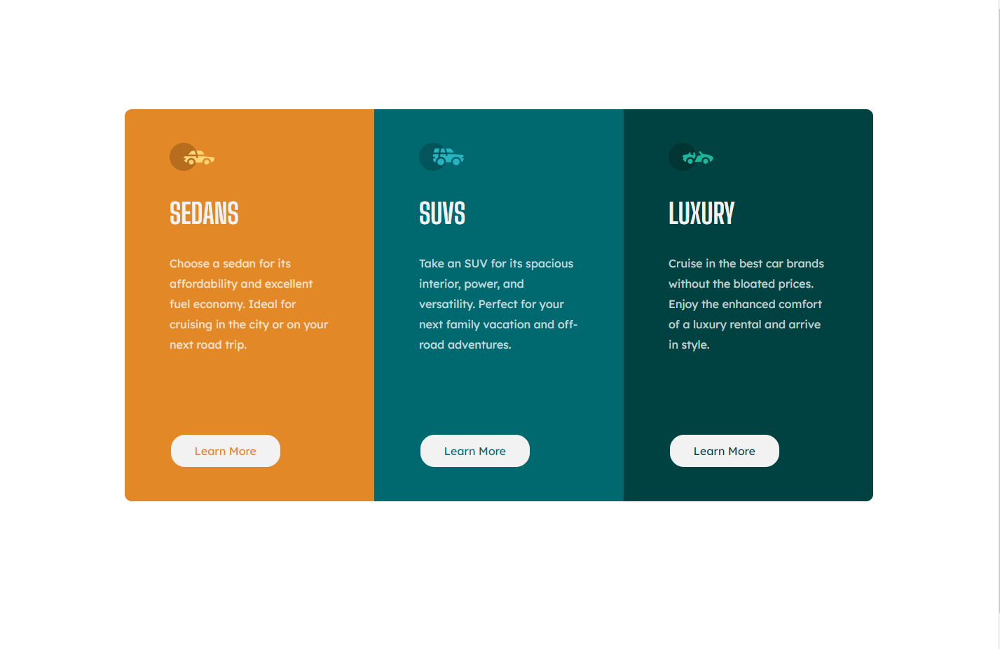

# Frontend Mentor - 3-column preview card component solution

This is a solution to the [3-column preview card component challenge on Frontend Mentor](https://www.frontendmentor.io/challenges/3column-preview-card-component-pH92eAR2-). Frontend Mentor challenges help you improve your coding skills by building realistic projects. 

## Table of contents

- [Overview](#overview)
  - [The challenge](#the-challenge)
  - [Screenshot](#screenshot)
  - [Links](#links)
- [My process](#my-process)
  - [Built with](#built-with)
  - [What I learned](#what-i-learned)
  - [Continued development](#continued-development)
  - [Useful resources](#useful-resources)
- [Author](#author)

## Overview

### The challenge

Users should be able to:

- View the optimal layout depending on their device's screen size
- See hover states for interactive elements

### Screenshot

### Links

- Live Site URL: [https://morbitdemon.github.io/3-column-preview-card-component-main/](https://morbitdemon.github.io/3-column-preview-card-component-main/)

## My process
- Built the HTML structure.
- Builded the Mobile design.
- Added complexity and a grid layout for desktop.

### Built with

- Semantic HTML5 markup
- CSS custom properties
- Grid
- Mobile-first workflow
- Media queries

### What I learned
 This was my first time doing mobile first design!
### Continued development

- Mobile first design
- Responsive design
- Grid

### Useful resources

- [Align content of a div to botton](https://www.w3docs.com/snippets/css/how-to-align-the-content-of-a-div-to-the-bottom.html) - This helped me to align the buttons to the bottom of the div.
## Author

- Frontend Mentor - [MorbitDemon](https://www.frontendmentor.io/profile/MorbitDemon)
